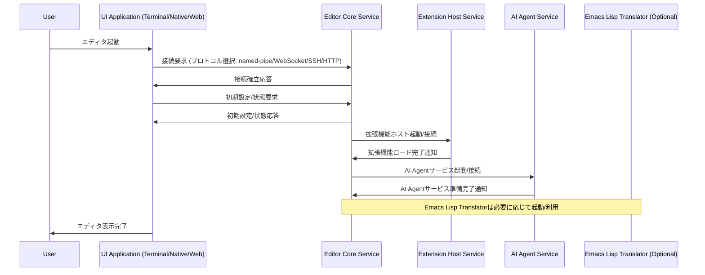
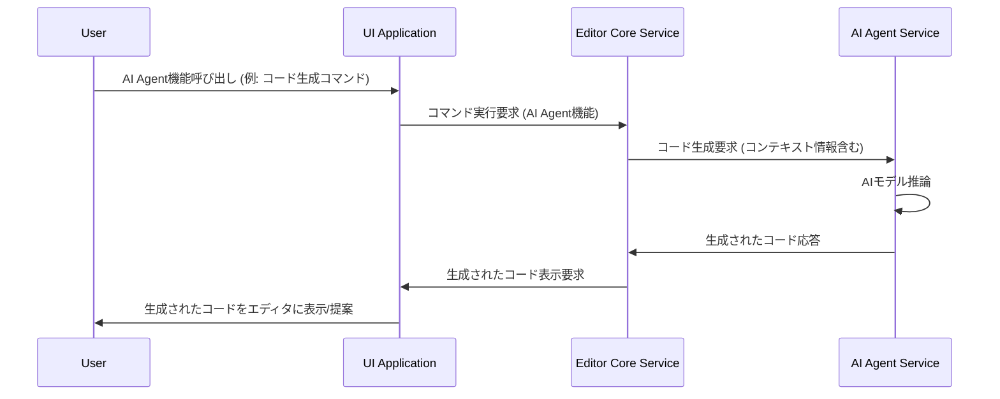
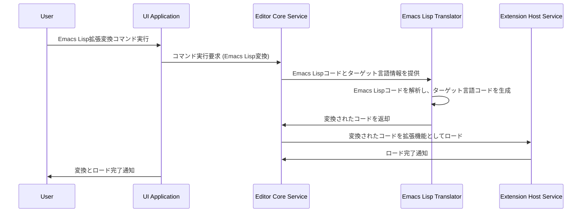
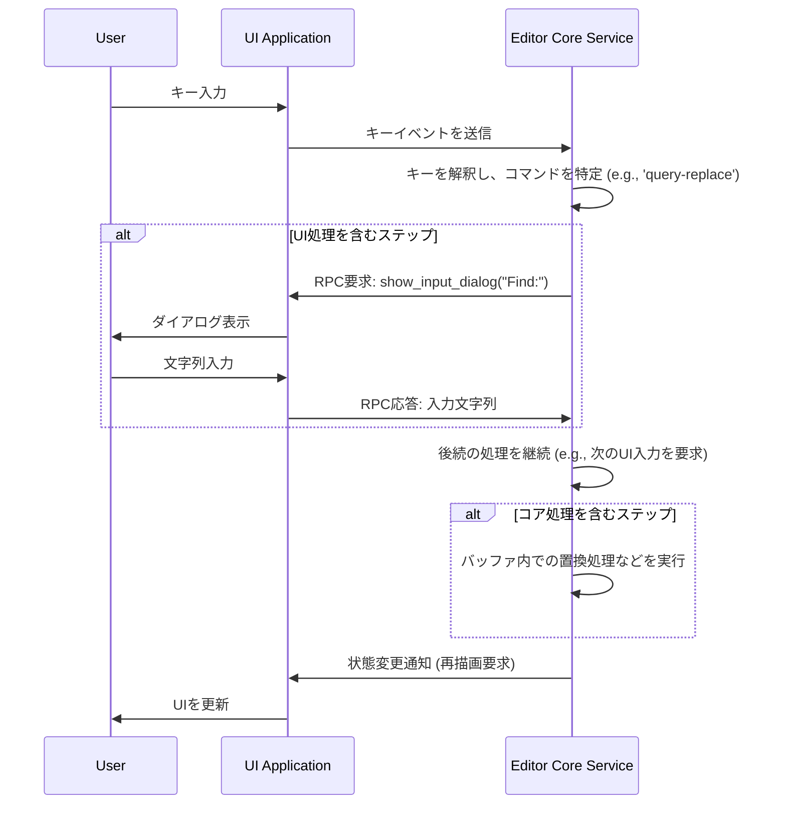
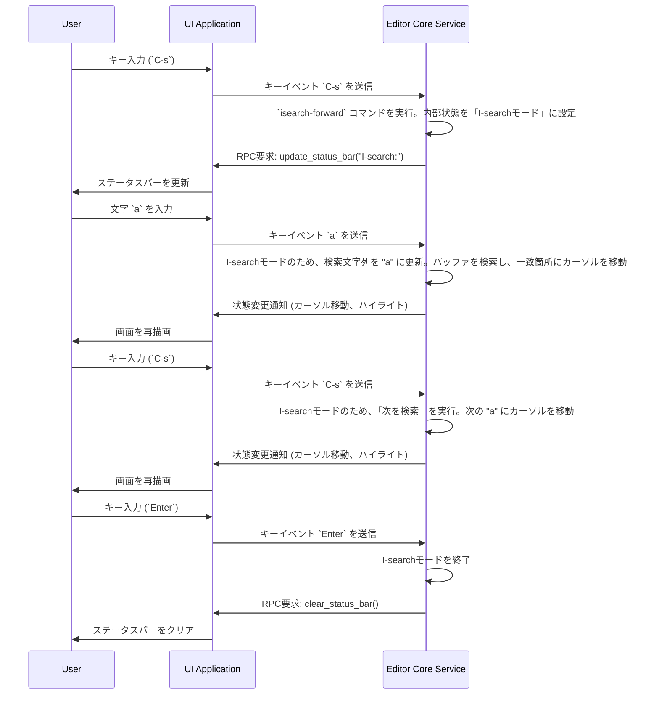
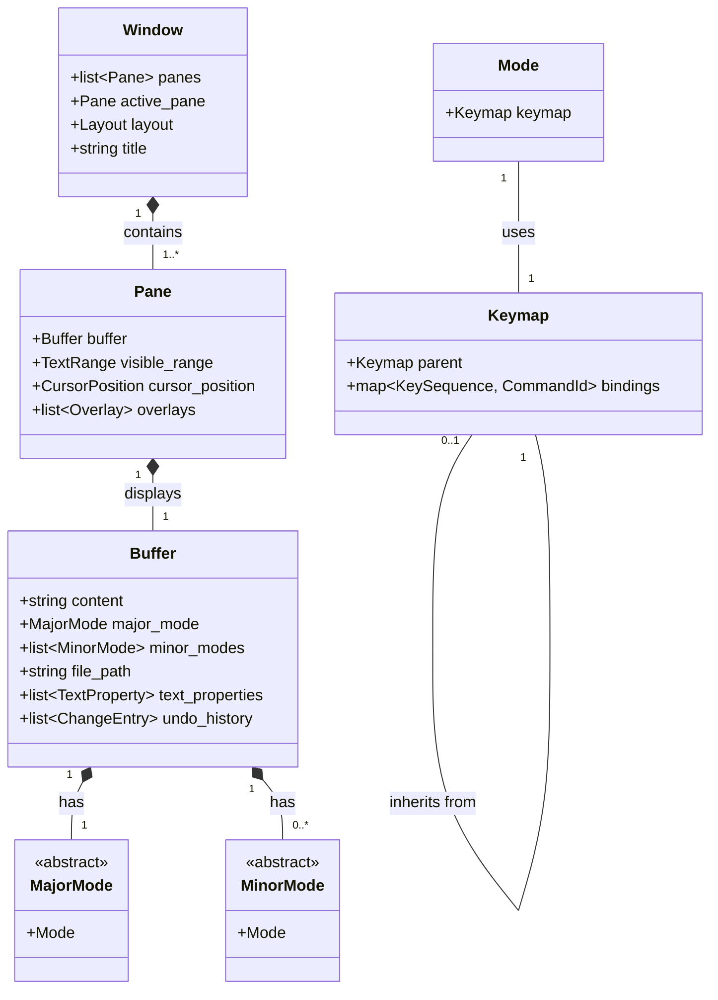

# Technical Design Document

## Overview
**Purpose**: 本設計ドキュメントは、Emacsユーザーを対象とした次世代エディタの技術設計を記述します。このエディタは、Emacsの強力な機能と操作性を維持しつつ、現代的な開発環境に適合するパフォーマンス、拡張性、およびユーザーエクスペリエンスを提供することを目的とします。
**Users**: Emacsユーザーは、既存の知識と習慣を活かしつつ、現代的な開発環境で求められる高機能と快適な操作性を持つエディタを利用できるようになります。
**Impact**: 本プロジェクトは、Emacsの主要な概念を継承しつつ、Rustによる高いパフォーマンスと分散アーキテクチャによる柔軟なUI対応を実現することで、既存のエディタ体験を革新します。

### Goals
- Emacsの主要な操作性（キーバインド、カーソル移動、リージョン操作など）を維持し、Emacsユーザーがスムーズに移行できるエディタを提供すること。
- 高いカスタマイズ性と拡張性を持ち、ユーザーが自身のワークフローに合わせてエディタを深く調整できること。
- 大規模なファイルや複雑な操作においても、高速かつ安定して動作するパフォーマンスを実現すること。
- コード補完、デバッグ、バージョン管理統合など、現代のIDEに求められる主要な機能を提供すること。
- UIとエディタコアを分離した分散型アーキテクチャを採用し、多様なUI環境（ターミナル、ネイティブGUI、Webブラウザ）に対応すること。
- dired, ediff, magitといったEmacsの主要パッケージと同等の機能を提供すること。
- 入力ソースの切り替え機能や国際化対応（i18n）をサポートすること。
- UTF-8をネイティブサポートし、バイナリファイルの編集モードを提供すること。
- AI Agentとの連携をサポートし、開発者の生産性向上や作業効率化に貢献すること。
- Emacs Lispから次世代エディタの拡張言語へのトランスレータを開発すること（優先度低）。

### Non-Goals
- 既存のEmacs拡張資産（Elispコードなど）の直接的な再利用はスコープ外とします。
- 右から左へ書く言語（RTL）への対応は、初期リリースの優先度を低く設定します。
- UNICODE以外の文字コードの直接編集はサポートしません（入出力時の変換のみ）。

## Architecture

### High-Level Architecture
次世代エディタは、UIとエディタコアを完全に分離した分散型アーキテクチャを採用します。これにより、UIはターミナル、ネイティブGUI、Webブラウザなど多様な環境で動作可能となり、エディタコアはバックエンドサービスとして機能します。フロントエンドとバックエンド間の通信は、セキュリティ、低遅延、スループットを考慮した複数のプロトコルを使い分けます。AI Agentとの連携は、独立したAI Agent Serviceを介して行われます。Emacs Lispトランスレータは、独立したツールまたはサービスとして提供される可能性があります。

```mermaid
graph TD
    SubGraph UI層
        A[ターミナルUI]
        B[ネイティブGUI]
        C[WebブラウザUI]
    End

    SubGraph バックエンド層
        D[エディタコアサービス]
        E[拡張機能ホスト]
        F[ファイルシステムサービス]
        G[プロセス管理サービス]
        H[AI Agentサービス]
        I[Emacs Lispトランスレータ]
    End

    A -- 接続プロトコル --> D
    B -- 接続プロトコル --> D
    C -- 接続プロトコル --> D

    D -- 拡張API --> E
    D -- ファイル操作 --> F
    D -- プロセス操作 --> G
    D -- AI Agent API --> H
    I -- 変換結果 --> E
```

**Architecture Integration**:
- **既存パターン**: Emacsのバッファ、ウィンドウ、ペインの3層構造の概念を維持し、ユーザーの操作モデルに一貫性を持たせます。
- **新コンポーネントの根拠**: UIとエディタコアの分離は、多様なプラットフォームへの対応と、パフォーマンス、安定性の向上を目的としています。拡張機能ホストは、多様な拡張言語をサポートし、エディタコアから分離することで安定性を高めます。AI Agentサービスは、AI機能の独立した管理と、エディタコアへの統合を可能にします。Emacs Lispトランスレータは、既存のEmacs Lisp資産を新しい拡張言語で利用するための移行支援ツールとして機能します。
- **技術アライメント**: 開発言語としてRustを採用し、高いパフォーマンスとメモリ安全性を確保します。Zedのソースコードを積極的に流用することで、開発効率を高めます。
- **ステアリング準拠**: コアステアリングドキュメントは存在しませんが、要件で定義された原則（Emacs互換性、カスタマイズ性、パフォーマンス、分散アーキテクチャなど）に準拠します。

### Technology Stack and Design Decisions

**Technology Stack**:
- **開発言語**: Rust
    - **選定理由**: 高いパフォーマンス、メモリ安全性、並行処理の容易さ、現代的な開発エコシステムとの親和性。
    - **既存資産の活用**: Rust製IDEであるZedのソースコードを積極的に流用し、特にテキストレンダリング、構文解析、ファイル操作などのコンポーネントを検討します。
- **拡張言語**: 設計段階で選定要件（Requirement 8, 10）に基づき、JavaScript, Perl, Python, Ruby, Lua などを候補として検討し、最終決定します。
- **UIフレームワーク**: 各UIタイプ（ターミナル、ネイティブGUI、Webブラウザ）に応じて最適なフレームワークを選定します。
    - **ターミナルUI**: `tui-rs`や`ratatui`などのRust製TUIライブラリを検討。
    - **ネイティブGUI**: `egui`, `iced`, `tauri` (Webviewベース) などを検討。
    - **WebブラウザUI**: `WebAssembly`と`React`/`Vue`などのJavaScriptフレームワークを組み合わせることを検討。
- **通信プロトコル**:
    - **低遅延**: `named-pipe` (ローカルIPC)、`WebSocket` (ネットワーク経由)
    - **高スループット**: `HTTP/2` (大容量データ転送)
    - **セキュリティ**: `SSH` (リモート接続)
    - **汎用**: `gRPC` (構造化データ、多言語対応)
- **AI Agent**: 外部のAIサービス（OpenAI GPT, Gemini, Copilotなど）との連携を想定。
- **Emacs Lispトランスレータ**: Emacs Lispの構文解析、抽象構文木 (AST) 変換、ターゲット拡張言語へのコード生成技術を検討。

**Key Design Decisions**:

- **Decision**: UIとエディタコアの完全分離と分散型アーキテクチャの採用
    - **Context**: 多様なUI環境への対応、パフォーマンスと安定性の向上、拡張性の確保という要件を満たすため。
    - **Alternatives**:
        1. モノリシックなエディタ（UIとコアが密結合）。
        2. プラグインアーキテクチャ（UIとコアは結合しつつ、機能拡張は分離）。
    - **Selected Approach**: UIとエディタコアを独立したプロセスまたはサービスとして動作させ、定義されたプロトコルを介して通信する。これにより、UIは任意の環境で動作可能となり、コアはUIに依存しない形で機能を提供できる。
    - **Rationale**: 現代的な開発環境の要求（多様なデバイス、リモート開発、クラウドネイティブ）に対応し、将来的な拡張性、保守性を高める上で最適。パフォーマンスボトルネックの分離や、クラッシュ耐性の向上にも寄与する。
    - **Trade-offs**: 初期開発の複雑性が増す。通信オーバーヘッドが発生する可能性があるが、低遅延プロトコルの採用や最適化で対応。

- **Decision**: 拡張言語のElispからの脱却と多言語サポート
    - **Context**: 既存のEmacs資産の再利用を意図せず、現代的な言語エコシステムとの親和性、Rustへの組み込みの容易さ、開発者の学習コスト低減という要件を満たすため。
    - **Alternatives**:
        1. Elisp互換の言語処理系をRustで実装。
        2. 特定の単一言語（例: JavaScript）に限定。
    - **Selected Approach**: 複数の候補言語（JavaScript, Python, Luaなど）から、選定要件（Requirement 8, 10）に基づき、Rust処理系への組み込みが容易で、かつ機能拡張開発者が簡便に利用できる言語を選定する。
    - **Rationale**: Elisp互換言語の実装はコストが高く、現代的な言語の豊富なライブラリやコミュニティの恩恵を受けられない。単一言語に限定すると、将来的な拡張性や開発者の選択肢を狭める可能性がある。複数の候補から最適なものを選定することで、バランスの取れた拡張性を提供する。
    - **Trade-offs**: 複数の言語処理系をサポートする場合、エディタのフットプリントが増加する可能性。各言語処理系のRustバインディングの成熟度やメンテナンスコストを考慮する必要がある。

- **Decision**: AI Agent連携の独立サービス化
    - **Context**: AI Agent機能の追加、多様なAIサービスへの対応、セキュリティとプライバシーの確保という要件を満たすため。
    - **Alternatives**:
        1. AI Agent機能をエディタコアに直接組み込む。
        2. AI Agent機能を拡張機能として実装する。
    - **Selected Approach**: AI Agent機能を独立したサービス（AI Agent Service）として提供し、エディタコアからAPIを介して連携する。
    - **Rationale**: AI Agentの機能は急速に進化しており、独立したサービスとすることで、特定のAIサービスに依存せず、柔軟な切り替えや複数のAIサービスの統合が可能になる。また、セキュリティとプライバシーの観点から、AI Agentがアクセスできる情報範囲を明確に制御しやすくなる。
    - **Trade-offs**: 独立サービス化により、初期開発の複雑性が若干増す。エディタコアとAI Agent Service間の通信オーバーヘッドが発生する可能性がある。

- **Decision**: コマンド実行のオーケストレーションと責務分担
    - **Context**: UI処理とコア処理の両方を含むコマンド（例: UIでユーザー入力を求め、その結果でバッファを更新する）を、分散アーキテクチャ上でアトミックに実行する必要がある。特に、拡張機能がUIとコアの両方をシームレスに操作できる仕組みが求められる。
    - **Alternatives**:
        1. **UI主導モデル**: UIがキーを解釈し、必要に応じてコアの処理をRPCで呼び出す。UIの応答性は高いが、コマンドのロジックが分散し、モードに基づいた複雑なキーマップ管理が困難になる。
        2. **イベント駆動モデル**: コアでの処理結果をイベントとして発行し、UIがそれを購読して自身の状態を更新する。コンポーネントは疎結合になるが、UIからの応答を待つような同期的な処理フローの実装が複雑になる。
    - **Selected Approach**: **エディタコアを司令塔（オーケストレーター）とするモデル**を採用する。UIはキーイベントを解釈せずにコアに送信する。コアはキーを解釈してコマンドを特定し、コマンドに含まれる処理ステップを順次実行する。UI処理が必要なステップでは、コアがUIに対してRPCを発行して処理を依頼し、必要であればその結果を待ってから後続のコア処理を継続する。
    - **Rationale**: コマンドの定義と実行ロジックをエディタコアに一元化できるため、管理が容易になる。拡張機能は、コアが提供するAPI（内部処理用関数とUI呼び出し用RPC）を組み合わせるだけで、UIとコアにまたがる複雑なコマンドを容易に作成できる。UIは描画とインタラクションに専念でき、責務が明確に分離される。
    - **Trade-offs**: すべてのキー入力がUI-コア間の通信を必要とするため、わずかな遅延が発生する可能性がある。しかし、これはローカル環境では無視できるレベルであり、リモート環境でもプロトコルの最適化で対応可能。それ以上に、ロジックの一元化と拡張性の高さというメリットが大きい。

- **Decision**: キーマクロの実装方針
    - **Context**: 一連のキー操作を記録・再生するキーマクロ機能 (Requirement 18) を実現する必要がある。
    - **Selected Approach**: エディタコアが「マクロ記録中」の状態を管理する。この状態の間、コアのイベント処理ループに渡されたキーイベントは、通常のコマンドとして実行されると同時に、マクロとしてリストに記録される。マクロの再生時は、記録されたキーイベントのシーケンスを、再度コアのイベント処理ループに投入することで操作を再現する。
    - **Rationale**: このアプローチは、コマンド実行のロジックを再実装することなく、あらゆるキー操作を忠実に記録・再現できるため、非常にシンプルかつ強力。既存のコマンド実行メカニズムにそのまま乗ることができる。
    - **Trade-offs**: マクロの実行速度は、個々のコマンドを人間が入力する速度と同程度になる可能性がある。パフォーマンスが重要な場合は、特定の操作シーケンスを単一の高速なコマンドとして実装する最適化も別途検討する価値がある。

- **Decision**: プロセスモデル: `fork()`によるバッファごとのプロセス分離
    - **Context**: 高い安定性、マルチコア性能、メモリ効率を実現するため、エディタコアのプロセスモデルを定義する必要がある。
    - **Selected Approach**: UIからの要求に応じて、バッファごとに独立したエディタコアプロセスを生成する。2つ目以降のプロセスは、既存のコアプロセスから `fork()` することで、Copy-on-Write (CoW) の恩恵を受け、メモリ効率と起動速度を向上させる。UIプロセスは常に1つとし、グローバルな状態（キルリング、入力履歴など）を管理する。
    - **Rationale**: 1つのバッファ（またはそこで動作する拡張機能）のクラッシュが他のバッファやUIに影響しない、究極の安定性を実現できる。CoWにより、多数のバッファを開いてもメモリ消費を効率的に抑えることが可能。
    - **Trade-offs & Mitigation**:
        - **`fork()`の安全性**: マルチスレッド環境での `fork()` はデッドロックのリスクを伴う。対策として、`fork()`後に子プロセス側でロック状態を含むすべての状態を厳格に再初期化する、あるいは`fork()`専用のシングルスレッドのランチャープロセスを設けるなど、慎重な設計を行う。
        - **Windows非互換性**: `fork()` はUNIX系OS (Linux, macOS) 専用の機能である。当面はUNIX系OSを主要ターゲットとする。将来的なWindows対応の際は、`fork`の代わりに`spawn`でプロセスを生成する（メモリ効率は低下）、またはWindows版のみシングルプロセス＋マルチスレッドモデルを採用するなどの代替アプローチを検討する。

- **Decision**: リモートプロセス起動モデル: 動的バイナリ注入
    - **Context**: リモートホスト上のファイルをシームレスに編集するため、SSH越しにエディタコアのプロセスを効率的かつクリーンに起動するメカニズムが必要 (Requirement 19)。
    - **Selected Approach**: UIクライアントは、接続先ホストのOS・アーキテクチャに対応したエディタコアのバイナリを保持する。SSH接続確立後、そのバイナリをネットワーク経由でリモートホストに転送し、実行する。特にリモートホストがLinuxの場合、`memfd_create`システムコールを利用してバイナリをメモリ上に展開し、ディスクに一時ファイルを残さずに直接実行する。
    - **Rationale**: リモートホストの環境を汚さず、セットアップ不要で即座にリモート編集を開始できる。`memfd_create`の利用は、セキュリティとクリーンさの観点から理想的である。
    - **Trade-offs**: クライアント側で各ターゲット（例: `x86_64-linux`, `aarch64-linux`）用のバイナリを管理する必要がある。`memfd_create`が使えないOS（古いLinuxカーネルなど）向けには、一時ファイルに書き出すフォールバック機構が必要になる。

## System Flows

### 起動とUI接続フロー


### AI Agent連携フロー (例: コード生成)


### Emacs Lispトランスレータ利用フロー (例: 拡張機能の変換)


### コマンド実行フロー (UI/コア連携)


### インクリメンタルサーチのフロー


### リモートホスト接続フロー (動的バイナリ注入)
```mermaid
sequenceDiagram
    participant User
    participant UIClient as UI Client (macOS)
    participant RemoteHost as Remote Host (Linux)
    participant EditorCore as Editor Core Process

    User->>UIClient: リモートホストへの接続を指示
    UIClient->>RemoteHost: SSH接続を確立
    Note over UIClient, RemoteHost: 適切なアーキテクチャのバイナリを選択
    UIClient->>RemoteHost: エディタコアのバイナリを転送
    RemoteHost->>RemoteHost: `memfd_create`でメモリファイルを作成し、バイナリを書き込む
    RemoteHost->>EditorCore: `fexecve`でメモリからプロセスを起動
    EditorCore-->>UIClient: 起動完了と通信準備OKを通知
    UIClient<->>EditorCore: RPCによる通信開始
```

## Components and Interfaces

### エディタコア層

#### Editor Core Service
**Responsibility & Boundaries**
- **Primary Responsibility**: テキストバッファの管理、編集操作の実行、ファイルI/O、モードとキーマップの管理、コマンドディスパッチとオーケストレーション、**インクリメンタルサーチやキーマクロといったインタラクティブな状態を持つコマンドの管理**、拡張機能APIの提供、AI Agent APIの提供。
- **Domain Boundary**: エディタの核となるロジックとデータ管理。UIや拡張機能、AI Agentからは独立。
- **Data Ownership**: テキストバッファの内容、Undo/Redo履歴、設定情報、ファイルシステムの状態、モードとキーマップの定義、**キーマクロの記録内容、インクリメンタルサーチの現在の状態**。
- **Transaction Boundary**: バッファへの変更操作はトランザクションとして管理され、Undo/Redoの単位となる。

**Dependencies**
- **Inbound**: UIアプリケーション、拡張機能ホスト、AI Agent Service、Emacs Lispトランスレータ
- **Outbound**: ファイルシステムサービス、プロセス管理サービス、拡張機能ホスト、AI Agent Service、Emacs Lispトランスレータ
- **External**: Zedのテキスト処理コンポーネント、正規表現ライブラリ

**Contract Definition**

**Service Interface** (Rust trait/struct)
```rust
// 簡略化された例
trait EditorCoreService {
    fn open_file(&self, path: &str) -> Result<BufferId, EditorError>;
    fn save_file(&self, buffer_id: BufferId) -> Result<(), EditorError>;
    fn get_buffer_content(&self, buffer_id: BufferId, range: TextRange) -> Result<String, EditorError>;
    fn apply_edit(&self, buffer_id: BufferId, edit: TextEdit) -> Result<(), EditorError>;
    fn undo(&self, buffer_id: BufferId) -> Result<(), EditorError>;
    fn redo(&self, buffer_id: BufferId) -> Result<(), EditorError>;
    fn execute_command(&self, command_id: CommandId, args: CommandArgs) -> Result<(), EditorError>;
    fn handle_key_event(&self, key_event: KeyEvent) -> Result<(), EditorError>; // キーイベントを解釈する
    fn define_keymap(&self, parent: Option<KeymapId>) -> Result<KeymapId, EditorError>;
    fn add_keybinding(&self, keymap_id: KeymapId, key_sequence: KeySequence, command_id: CommandId) -> Result<(), EditorError>;
    fn set_major_mode(&self, buffer_id: BufferId, mode_id: MajorModeId) -> Result<(), EditorError>;
    fn add_minor_mode(&self, buffer_id: BufferId, mode_id: MinorModeId) -> Result<(), EditorError>;
    fn get_kill_ring_entries(&self) -> Vec<KillRingEntry>;
    fn set_input_method(&self, method_id: InputMethodId) -> Result<(), EditorError>;
    fn call_ai_agent(&self, agent_id: AgentId, task: AITask, context: AIContext) -> Result<AIResponse, EditorError>;
    fn call_elisp_translator(&self, elisp_code: String, target_lang: String) -> Result<TranslatedCode, EditorError>; // 追加
    // ... その他、Emacs互換操作、IDE機能、パッケージ機能に関するAPI
}
```
- **Preconditions**: 適切な認証と認可、有効な`BufferId`や`CommandId`。
- **Postconditions**: 成功した場合、要求された操作が完了し、バッファの状態が更新される。
- **Invariants**: バッファの内容は常に整合性が保たれる。Undo/Redo履歴は正しく管理される。

#### Extension Host Service
**Responsibility & Boundaries**
- **Primary Responsibility**: 拡張言語の実行環境を提供し、拡張機能のロード、アンロード、実行、デバッグを管理。エディタコアとのAPI連携。
- **Domain Boundary**: 拡張機能のサンドボックス化とライフサイクル管理。
- **Data Ownership**: 拡張機能の設定、状態、ログ。
- **Transaction Boundary**: 拡張機能によるエディタコアへの変更は、エディタコアのトランザクション境界内で処理される。

**Dependencies**
- **Inbound**: Editor Core Service
- **Outbound**: 拡張機能のコード、OSのコア機能/API (限定的)
- **External**: 選定された拡張言語のランタイム/インタプリタ

**Contract Definition**

**Service Interface** (Rust trait/struct)
```rust
// 簡略化された例
trait ExtensionHostService {
    fn load_extension(&self, path: &str) -> Result<ExtensionId, ExtensionError>;
    fn unload_extension(&self, id: ExtensionId) -> Result<(), ExtensionError>;
    fn call_extension_function(&self, id: ExtensionId, function_name: &str, args: Value) -> Result<Value, ExtensionError>;
    fn register_command_from_extension(&self, extension_id: ExtensionId, command_id: CommandId, handler: FunctionRef) -> Result<(), ExtensionError>;
    // ... 拡張機能がOSのコア機能やAPIにアクセスするためのAPI (セキュリティ考慮)
}
```
- **Preconditions**: 有効な拡張機能パス、適切な権限。
- **Postconditions**: 拡張機能がロード/アンロードされ、エディタコアとの連携が可能になる。
- **Invariants**: 拡張機能の実行はサンドボックス化され、エディタコアの安定性を損なわない。

#### AI Agent Service
**Responsibility & Boundaries**
- **Primary Responsibility**: 外部AIサービスとの連携、AIモデルの呼び出し、AI Agent機能の管理。
- **Domain Boundary**: AI Agent機能の抽象化とセキュリティ管理。
- **Data Ownership**: AI Agentの設定、認証情報、利用履歴（プライバシー考慮）。
- **Transaction Boundary**: AI Agentへの要求と応答の処理。

**Dependencies**
- **Inbound**: Editor Core Service
- **Outbound**: 外部AIサービスAPI
- **External**: 外部AIサービス（OpenAI GPT, Gemini, Copilotなど）

**Contract Definition**

**Service Interface** (Rust trait/struct)
```rust
// 簡略化された例
trait AIAgentService {
    fn execute_code_generation(&self, context: CodeContext) -> Result<GeneratedCode, AIAgentError>;
    fn execute_code_review(&self, code: String) -> Result<CodeReviewResult, AIAgentError>;
    fn answer_question(&self, question: String, context: TextContext) -> Result<Answer, AIAgentError>;
    fn configure_agent(&self, agent_id: AgentId, config: AgentConfig) -> Result<(), AIAgentError>;
    // ... その他、AI Agent機能に関するAPI
}
```
- **Preconditions**: 適切な認証情報、有効なAI Agent ID。
- **Postconditions**: AI Agentからの応答が返される。
- **Invariants**: ユーザーのプライバシーとセキュリティが保護される。

#### Emacs Lisp Translator
**Responsibility & Boundaries**
- **Primary Responsibility**: Emacs Lispコードを次世代エディタの拡張言語（選定された言語）のコードに変換する。
- **Domain Boundary**: Emacs Lispの構文解析、抽象構文木 (AST) 変換、ターゲット言語へのコード生成。
- **Data Ownership**: 変換プロセスにおける中間表現。
- **Transaction Boundary**: 単一の変換要求。

**Dependencies**
- **Inbound**: Editor Core Service
- **Outbound**: なし
- **External**: Emacs Lispの構文解析ライブラリ、ターゲット拡張言語のコード生成ライブラリ

**Contract Definition**

**Service Interface** (Rust trait/struct)
```rust
// 簡略化された例
trait EmacsLispTranslator {
    fn translate_elisp_to_extension_lang(&self, elisp_code: String, target_lang: String) -> Result<TranslatedCode, TranslatorError>;
    fn analyze_elisp_code(&self, elisp_code: String) -> Result<ElispAST, TranslatorError>;
    // ... その他、変換支援機能
}
```
- **Preconditions**: 有効なEmacs Lispコード、サポートされているターゲット言語。
- **Postconditions**: 変換されたコードが返される。
- **Invariants**: 変換されたコードは、元のEmacs Lispコードの意図を可能な限り正確に反映する。

### UI層

#### UI Application (Terminal/Native/Web)
**Responsibility & Boundaries**
- **Primary Responsibility**: ユーザー入力の受付、エディタコアからの情報表示と描画要求の処理、UI固有のレンダリング、**エディタコアからのRPC要求の処理**。
- **Domain Boundary**: ユーザーとのインタラクションと視覚的な表現。エディタのロジックからは分離。
- **Data Ownership**: UIの状態、表示言語設定。
- **Transaction Boundary**: ユーザー入力イベントをエディタコアに送信すること。コアからの描画要求を処理すること。

**Dependencies**
- **Inbound**: User
- **Outbound**: Editor Core Service
- **External**: UIフレームワーク、OSの入力ソースAPI

**Contract Definition**

**Service Interface** (Rust trait/struct, または各UIフレームワークのAPI)

`EditorCore` からのRPC呼び出しを受け付けるインターフェースを含む。

```rust
// 簡略化された例
// UIが実装し、EditorCoreが呼び出すRPCインターフェース
trait UICallback {
    async fn show_message(&self, message: String) -> Result<(), UIError>;
    async fn show_input_dialog(&self, prompt: String, default_value: String) -> Result<Option<String>, UIError>;
    async fn show_menu(&self, items: Vec<MenuItem>, position: Position) -> Result<Option<MenuItemId>, UIError>;
}

// UI自身の責務
trait UIApplication {
    fn handle_key_event(&self, event: KeyEvent);
    fn render_buffer_content(&self, content: RenderableContent);
    fn update_status_bar(&self, message: &str);
    // ... その他、UI固有の機能
}
```
- **Preconditions**: Editor Core Serviceとの接続が確立されていること。
- **Postconditions**: ユーザー入力が処理され、UIが適切に更新される。
- **Invariants**: UIは常にEditor Core Serviceの最新の状態を反映する。

## Data Models

### Emacs概念のデータモデル
Emacsの主要な概念であるフレーム、ウィンドウ、バッファの3層構造を維持しつつ、現代的な名称に対応させます。

- **Window**: Emacsの `frame` に相当。OSの1ウィンドウを表します。
- **Pane**: Emacsの `window` に相当。`Window` 内の分割された各区画を表します。
- **Buffer**: `Pane` に表示されるテキストコンテンツ。



**TextProperty**:
- **fontの各属性**: `font-family`, `font-size`, `font-stretch`, `font-style`, `font-height`
- **色**: `color`, `background-color`
- **ボーダー**: `border` (テキストに対するボーダーのみ)
- **ホワイトスペース**: `white-space` (折り返し表示が有効な場合のみ)
これらの属性は、Zedの実装を参考にしつつ、CSS1〜2.1あたりのテキスト表現を包含できるようなデータ構造で管理します。

**Kill Ring**:
- 複数の履歴の保持と利用、履歴の循環利用、履歴の永続化とOSのクリップボードとの連携機能を維持します（優先度高）。
- マネージャ機能を追加し、エントリの追加、削除、順序の入れ換え等の編集機能を持たせます（優先度低）。

**モードとキーマップ**:
- **モード**: 各バッファは、1つの`MajorMode`と複数の`MinorMode`を持ちます。モードはバッファの挙動（構文ハイライト、インデント、キーバインドなど）を決定します。
- **キーマップ**: キーシーケンスとコマンドの対応表です。キーマップは他のキーマップを継承でき、差分を定義することが可能です。バッファに適用される最終的なキーマップは、グローバル、メジャーモード、マイナーモードの各キーマップが優先順位に従って合成されたものになります。

## Error Handling

### Error Strategy
エディタコアとUIアプリケーション間で発生するエラーは、明確なエラーコードとメッセージを持つ構造化されたエラーオブジェクトとして伝達されます。これにより、UI側で適切なエラー表示や回復処理を行うことが可能になります。拡張機能からのエラーは、サンドボックス内で捕捉され、エディタコアに通知されます。AI Agent Serviceからのエラーも同様に構造化されたエラーとして伝達されます。Emacs Lispトランスレータからのエラーも、変換失敗などの情報として適切に処理されます。

### Error Categories and Responses
- **ユーザーエラー (例: 無効な入力、ファイルが見つからない)**: UI側でユーザーに分かりやすいメッセージを表示し、可能な場合は修正を促します。
- **システムエラー (例: ファイルI/Oエラー、通信エラー)**: UI側でエラーを通知し、再試行や代替操作を提案します。エディタコアは可能な限り安定した状態を維持し、クラッシュを避けます。
- **拡張機能エラー**: 拡張機能ホストがエラーを捕捉し、拡張機能の実行を停止または隔離します。ユーザーにはエラー発生を通知し、拡張機能の無効化やデバッグを促します。
- **AI Agentエラー**: AI Agent Serviceがエラーを捕捉し、エディタコアに通知します。UI側でユーザーにエラー内容を伝え、再試行や設定変更を促します。
- **Emacs Lispトランスレータエラー**: 変換失敗などのエラーをエディタコアに通知し、UI側でユーザーにエラー内容（例: 構文エラー、未サポートの機能）を伝えます。

### Monitoring
エディタコア、UIアプリケーション、AI Agent Service、Emacs Lispトランスレータは、エラーログ、パフォーマンスメトリクス、クラッシュレポートを収集し、開発者が問題を特定・解決できるようにします。

## Testing Strategy

**基本方針として、テスト駆動開発（TDD）を全面的に採用する。** すなわち、機能を追加・変更する際は、まずその機能の要求を満たすテストを記述し、そのテストが通るように実装を進める。

- **ユニットテスト**: エディタコアの各モジュール（バッファ管理、キーバインド処理、コマンドディスパッチなど）、拡張機能ホストの言語バインディング、UIコンポーネントのロジック、AI Agent Serviceの外部AIサービス連携ロジック、Emacs Lispトランスレータの変換ロジックに対して実施します。
- **統合テスト**: UIとエディタコア間の通信、エディタコアと拡張機能ホスト間の連携、ファイルシステムサービスとの連携、AI Agent Serviceとの連携、Emacs Lispトランスレータとの連携など、複数のコンポーネを跨るフローに対して実施します。
- **E2Eテスト**: ターミナルUI、ネイティブGUI、WebブラウザUIのそれぞれで、主要なユーザーシナリオ（ファイル編集、保存、検索、拡張機能の利用、AI Agent機能の利用、Emacs Lisp拡張の変換・利用など）に対して実施します。
- **パフォーマンステスト**: 大規模ファイル操作、高速なテキスト編集、多数の拡張機能ロード時、AI Agentの応答時間など、パフォーマンスが要求されるシナリオに対して実施し、Zedのベンチマーク結果を基準に評価します。

## Security Considerations
- **通信セキュリティ**: UIとエディタコア間の通信は、リモート接続の場合にSSHなどのセキュアなプロトコルを使用し、データ暗号化と認証を確保します。AI Agent Serviceと外部AIサービス間の通信も同様にセキュアなプロトコルを使用します。
- **拡張機能のサンドボックス化**: 拡張機能はサンドボックス環境で実行され、ファイルシステムやネットワークへのアクセスは厳密に制御されます。OSのコア機能やAPIへのアクセスは、明示的な許可とセキュリティレビューを経て提供されます。
- **AI Agentのデータアクセス制御**: AI Agentがコードやファイルの内容にアクセスする場合、アクセス範囲を明確に定義し、ユーザーの同意なしに機密情報が外部に送信されないように厳格な制御を行います。認証情報（APIキーなど）は安全に管理されます。
- **Emacs Lispトランスレータのセキュリティ**: 変換されるEmacs Lispコードの安全性は保証されないため、変換後のコードの実行は拡張機能ホストのサンドボックス内で厳格に管理されます。
- **入力検証**: ユーザー入力や外部からのデータは厳格に検証され、インジェクション攻撃やバッファオーバーフローなどの脆弱性を防ぎます。

## Performance & Scalability
- **目標メトリクス**: Zedの最新安定版のパフォーマンスベンチマーク結果を基準とし、ファイルロード時間、検索・置換速度、UI応答性、メモリ使用量、AI Agentの応答時間などを主要なメトリクスとします。
- **スケーリング**: 分散型アーキテクチャにより、エディタコア、UI、AI Agent Serviceを独立してスケールさせることが可能です。特にリモート開発シナリオでは、エディタコアやAI Agent Serviceを高性能なサーバー上で動作させ、UIを軽量なクライアントで利用することで、スケーラビリティを確保します。
- **最適化**: Rustの活用、Zedの高性能コンポーネントの流用、非同期処理の積極的な利用により、パフォーマンスを最大化します。

## 開発ロードマップ（大規模タスク分割）

本プロジェクトは、以下の大規模タスク（エピック）に分割して、反復的に開発を進める。

1.  **E01: 基盤構築とプロセス間RPC通信路 (別SPEC `01-process-rpc` として管理)**
    *   内容: UIプロセスとエディタコアプロセス間のRPC通信基盤を構築します。詳細な要件と設計は `01-process-rpc` SPECで定義・管理されます。
    *   ゴール: UIプロセスとコアプロセスが、`01-process-rpc` SPECで定義されたRPC通信路を介して接続できる。

2.  **E02: ファイル表示機能**
    *   内容: `Window`, `Pane`, `Buffer` の基本データ構造を実装。UIからの要求でファイルを読み込み、その内容をUIに送信してテキストを描画する。
    *   ゴール: ファイルを開くと、その内容が表示される。

3.  **E03: 基本的な編集機能**
    *   内容: キーマップとコマンドディスパッチの基本機構、および文字入力・削除・カーソル移動コマンドを実装する。UIからのキーイベントでバッファを更新し、再描画させる。
    *   ゴール: 最小限のテキストエディタとして、文字の入力とカーソル移動ができるようになる。

4.  **E04: プロセスモデルの導入 (`fork`)**
    *   内容: E01-E03で確立した機能をベースに、`fork()`による複数バッファ＝複数プロセスのアーキテクチャを導入する。
    *   ゴール: 複数のファイルを、それぞれ独立したコアプロセスで開けるようになる。

5.  **E05: 高度なUI（複数ペインとウィンドウ）**
    *   内容: UI側で、ウィンドウ内に複数のペインを作成・分割・リサイズするレイアウト管理機能を実装する。各ペインが異なるコアプロセスと通信できるようにする。
    *   ゴール: Emacsのように画面を分割し、複数のファイルを同時に表示・編集できる。

6.  **E06: 高度な編集機能（I-Searchとキーマクロ）**
    *   内容: 状態を持つインタラクティブなコマンド（インクリメンタルサーチ）や、キーイベントの記録・再生（キーマクロ）といった、より複雑な編集機能を実装する。
    *   ゴール: `C-s`での検索や、キーマクロの記録・再生が機能する。

7.  **E07: リモート開発機能**
    *   内容: SSH経由でのリモートプロセス起動（動的バイナリ注入）を実装する。
    *   ゴール: リモートホスト上のファイルをシームレスに開けるようになる。

## 将来的な拡張案

本プロジェクトの設計・開発を進める中で出てきた、すぐには着手しないが将来的には検討すべき課題や拡張案をここに記録する。

- **ローカル通信経路の暗号化**
  - **コンテキスト**: エピックE01（基盤構築とプロセス間RPC通信路）のセキュリティ検証にて議論。
  - **内容**: 現状、ローカルのUI-コア間通信は暗号化されていない。より高いセキュリティが求められる環境向けに、これを暗号化する機能をオプションとして提供する。
  - **実装案**: ユーザーの環境に依存しないTLS（自己署名証明書）方式、あるいはリモート接続と実装を統一できるSSHポートフォワーディング方式が考えられる。ユーザーが設定で有効化できるようにするのが望ましい。

- **コアプロセスが使用するTCPポート範囲の指定**
  - **コンテキスト**: エピックE01（基盤構築とプロセス間RPC通信路）の設計レビューにて議論。
  - **内容**: ファイアウォールなどで利用可能なポートが制限されている環境向けに、コアプロセスが動的に割り当てるポートの範囲を設定で指定できる機能を提供する。
