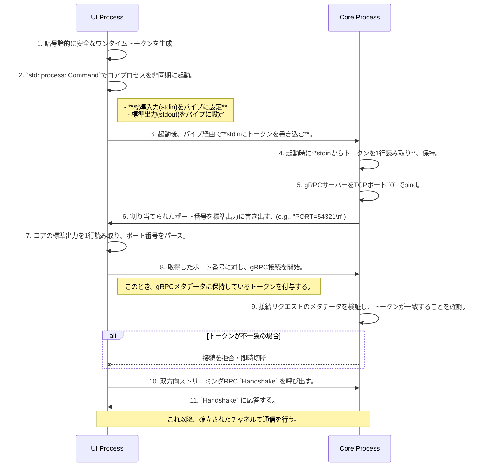

# E01: Design Document

## 1. Overview

本ドキュメントは、エピック「E01: 基盤構築とプロセス間RPC通信路」の技術設計を定義する。
目的は、以下の通り。

- UIとコア、2つの独立したプロセスから成るアプリケーションの基本構造を確立する。
- プロセス間でgRPCを用いた、堅牢で双方向の通信チャネルを確立する。
- 今後の開発の礎となる、クリーンでスケーラブルなプロジェクト基盤を構築する。

## 2. Technology Stack

- **RPC Framework**: [Tonic](https://github.com/hyperium/tonic)
  - **理由**: RustにおけるデファクトスタンダードのgRPC実装。パフォーマンス、信頼性、エコシステムの成熟度が高い。
- **Schema Definition**: [Protocol Buffers (Protobuf v3)](https://protobuf.dev/)
  - **理由**: gRPCの標準シリアライズ形式。厳密なスキーマ定義とコード自動生成により、開発効率と堅牢性を向上させる。
- **Process Management**: `std::process::Command`
  - **理由**: Rustの標準ライブラリであり、外部依存なく子プロセスの起動と管理が可能。

## 3. Project Structure

`cargo`のワークスペース機能を利用し、単一リポジトリ内で複数のクレートを管理する。

```text
.
├── Cargo.toml         # ワークスペース定義
├── proto/             # Protobufスキーマ定義
│   └── editor.v1.proto
├── core/              # コアプロセス クレート
│   ├── build.rs       # tonic-buildによるコード生成
│   └── src/
│       └── main.rs
└── ui/                # UIプロセス クレート
    ├── build.rs       # tonic-buildによるコード生成
    └── src/
        └── main.rs
```

- **`build.rs`**: `tonic-build`クレートを利用し、`cargo build`時に`proto/editor.v1.proto`からRustのコードを自動生成する。

## 4. System Flows

### 4.1. プロセス起動、認証、RPC接続フロー

UIプロセスがコアプロセスを起動し、認証を経て、通信を確立するまでの流れ。



### 4.2. ハートビート (Keepalive) 機構

gRPCの標準機能であるキープアライブを利用して、接続の健全性を監視する。

- **設定**: UIクライアント側で、`tonic`の`Endpoint`設定時にキープアライブのパラメータを設定する。
  - `keep_alive_while_idle(true)`: RPCコールがないアイドル時もキープアライブを有効化。
  - `http2_keep_alive_interval(Duration)`: PINGを送信する間隔（例: 60秒）。
  - `keep_alive_timeout(Duration)`: PINGに対する応答を待つタイムアウト時間（例: 10秒）。
- **動作**: コアプロセスがクラッシュしたり、ネットワークが切断されると、PINGへの応答がなくなる。UIクライアントはタイムアウト後に接続エラーを検知し、後続の処理（再接続やユーザーへの通知など）に移行できる。

## 5. Schema Definition (`proto/editor.v1.proto`)

UIとコア間のAPIを定義するスキーマ。E01では、接続確認のための最小限のRPCを定義する。

```protobuf
syntax = "proto3";

package editor.v1;

// UI-コア間のRPCサービス
service EditorService {
  // 挨拶と基本情報交換のための双方向ストリーミングRPC
  rpc Handshake(stream HandshakeRequest) returns (stream HandshakeResponse);
}

// UIからコアへのメッセージ
message HandshakeRequest {
  string client_message = 1; // 例: "Hello, Core! from UI-PID-12345"
}

// コアからUIへのメッセージ
message HandshakeResponse {
  string server_message = 1; // 例: "Hello, UI! from Core-PID-54321"
}
```

## 6. Error Handling

- **コアプロセス起動失敗**: `std::process::Command`が返す`Result`をハンドリングし、エラーログを出力してUIプロセスを終了する。
- **ポート番号の取得失敗**: コアの標準出力からポート番号をパースできなかった場合（タイムアウト、不正な形式など）、コアプロセスを終了させ、エラーログを出力してUIプロセスも終了する。
- **gRPC接続失敗**: 指定されたポートへの接続に失敗した場合、エラーログを出力して終了する。
- **認証失敗**: コアが受け取った接続リクエストに不正なトークンが含まれていた場合、コアは接続を即時切断する。UI側は接続が拒否されたことを示すエラーをハンドリングする。
- **通信中の切断 (Keepaliveによる検知)**: `tonic`が返す`Status`エラーをハンドリングし、接続が切断された旨をログに出力する。将来的には、再接続処理やユーザーへの通知機能を実装する。
